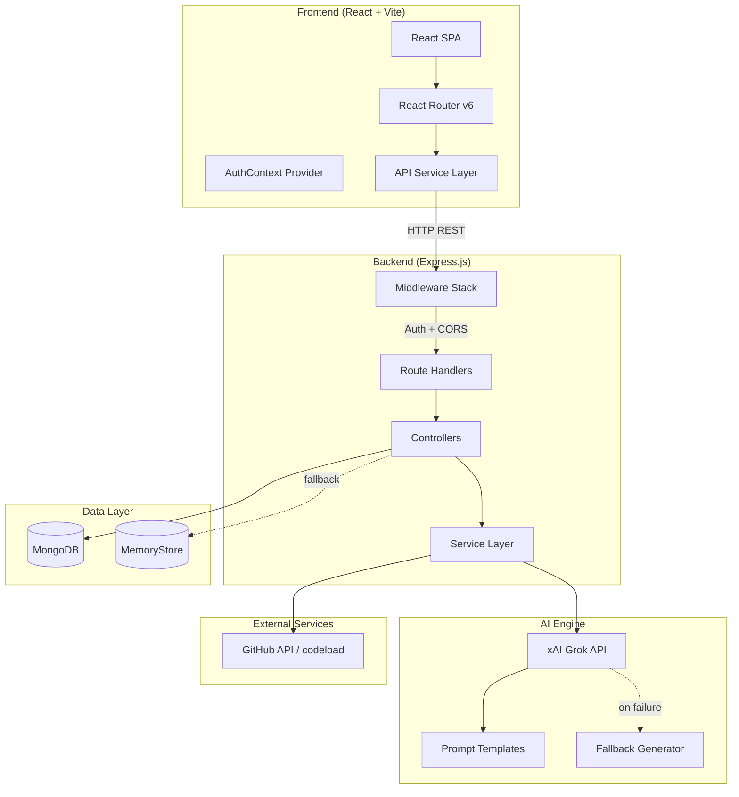
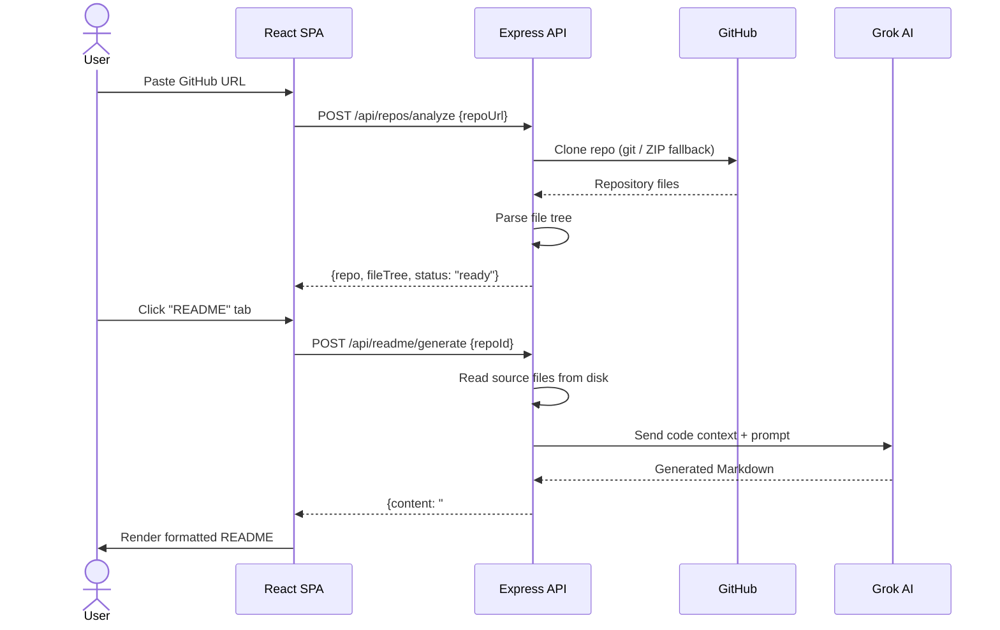
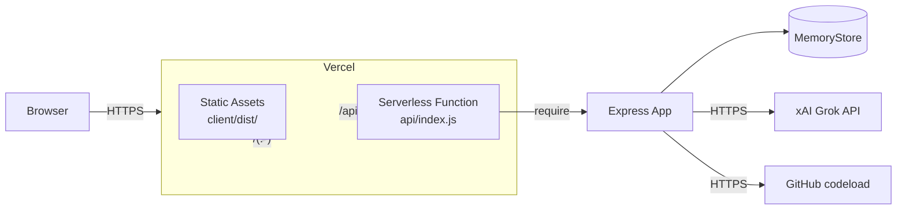

# ReadMyCode — Architecture Document

## 1. Overview

ReadMyCode is an AI-powered code analysis and documentation platform. Users submit a public GitHub repository URL (or upload a ZIP archive), and the system automatically generates:

- **README documentation** — human-readable project overview
- **API documentation** — structured endpoint reference
- **Flowchart diagrams** — Mermaid.js control-flow visualizations
- **Architecture diagrams** — system-level component graphs
- **Function explanations** — AI-generated breakdowns of key functions
- **Code debugger** — static analysis and issue detection

---

## 2. Tech Stack

| Layer | Technology | Purpose |
|-------|-----------|---------|
| **Frontend** | React 18 + Vite 5 | SPA with hot-reload dev server |
| **Styling** | Tailwind CSS 3 | Utility-first responsive design |
| **Typography** | Plus Jakarta Sans, JetBrains Mono | Enterprise-grade readability |
| **Diagrams** | Mermaid.js 10.9 | Flowchart and architecture rendering |
| **Backend** | Express.js 4 (Node 18+) | REST API server |
| **AI Engine** | xAI Grok API (`grok-2-latest`) | LLM-powered code analysis |
| **Database** | MongoDB (Mongoose 8) | Primary persistent store |
| **Fallback DB** | In-Memory MemoryStore | Zero-dep fallback when MongoDB unavailable |
| **Auth** | JWT (jsonwebtoken) + bcryptjs | Stateless token authentication |
| **Git Integration** | simple-git + GitHub codeload ZIP | 3-tier repo cloning with automatic fallback |
| **File Upload** | Multer | ZIP archive upload handling |
| **Deployment** | Vercel (Serverless Functions) | Frontend static + backend serverless |

---

## 3. High-Level System Architecture



---

## 4. Data Model

### User
```
{
  _id:        ObjectId / String
  name:       String (required)
  email:      String (unique, lowercase, trimmed)
  password:   String (bcrypt hashed)
  createdAt:  Date
}
```

### Repo
```
{
  _id:        ObjectId / String
  owner:      ObjectId → User._id
  repoUrl:    String (GitHub URL or "zip-upload:<filename>")
  repoName:   String
  status:     Enum ["cloning", "parsing", "ready"]
  fileTree:   Array<{name, path, type, size, children}>
  localPath:  String (temp directory path)
  createdAt:  Date
  updatedAt:  Date
}
```

### Analysis (per-feature result)
```
{
  _id:        ObjectId / String
  repo:       ObjectId → Repo._id
  owner:      ObjectId → User._id
  type:       Enum ["readme", "apiDocs", "flowchart", "architecture", "functionExplain", "debug"]
  content:    Mixed (Markdown string, JSON object, or Mermaid string)
  meta:       Object (additional metadata)
  createdAt:  Date
}
```

---

## 5. API Endpoint Map

| Method | Endpoint | Description |
|--------|----------|-------------|
| `POST` | `/api/auth/register` | Create new user account |
| `POST` | `/api/auth/login` | Authenticate and return JWT |
| `GET` | `/api/auth/me` | Get current user profile |
| `POST` | `/api/repos/analyze` | Analyze a GitHub repo by URL |
| `POST` | `/api/repos/upload` | Upload and analyze a ZIP archive |
| `GET` | `/api/repos` | List user's analyzed repositories |
| `GET` | `/api/repos/:id` | Get single repo details + file tree |
| `DELETE`| `/api/repos/:id` | Delete an analyzed repository |
| `POST` | `/api/readme/generate` | Generate README for a repo |
| `POST` | `/api/docs/generate` | Generate API documentation |
| `POST` | `/api/diagrams/flowchart` | Generate Mermaid flowchart |
| `POST` | `/api/diagrams/architecture` | Generate architecture diagram |
| `POST` | `/api/diagrams/functions` | Generate function explanations |
| `POST` | `/api/debug/analyze` | Run debug/static analysis |
| `GET` | `/api/dashboard/stats` | Get dashboard statistics |
| `GET` | `/api/health` | Health check endpoint |

---

## 6. Request Flow



---

## 7. Deployment Architecture (Vercel)



- **Static files**: `client/dist/` served from Vercel CDN
- **API routes**: `/api/*` routed to `api/index.js` serverless function
- **Temp storage**: `os.tmpdir()` (`/tmp`) for cloned repos (ephemeral)
- **Database**: MemoryStore in serverless (stateless per invocation)

---

## 8. Security

- **Authentication**: JWT tokens with 7-day expiry, bcrypt password hashing (10 salt rounds)
- **CORS**: Dynamic origin reflection for cross-origin requests
- **Input validation**: URL pattern matching for GitHub repos, 5MB JSON body limit, 50MB ZIP upload limit
- **File system isolation**: Repos cloned to `os.tmpdir()`, cleaned up after analysis
- **Environment secrets**: API keys stored in `.env` (gitignored), Vercel environment variables in production
